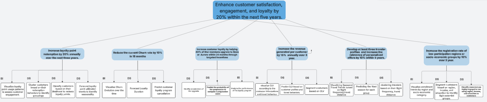
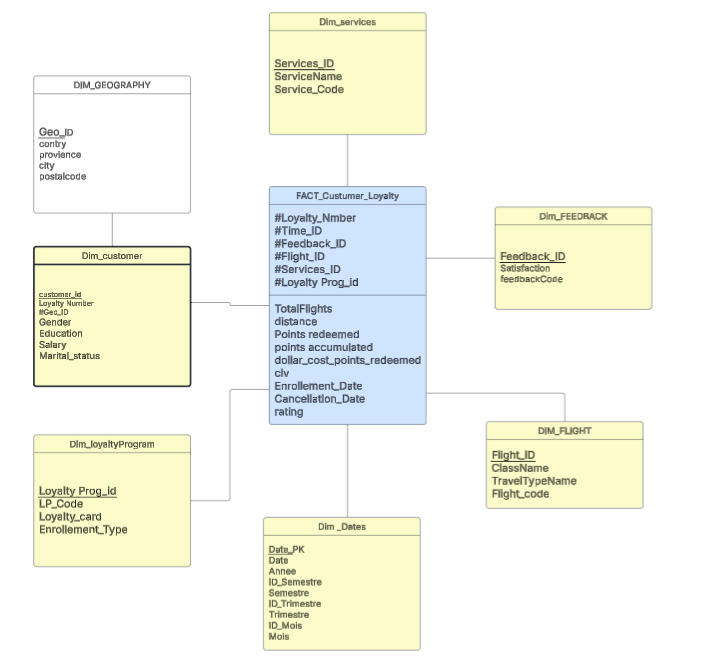
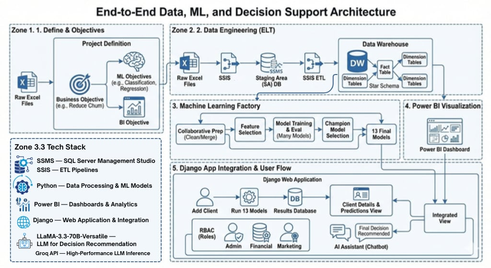

# ✈️ Airline Loyalty Program  
## Business Intelligence & Machine Learning Project

---

## 📌 Project Overview

This project aims to **analyze, optimize, and enhance an airline loyalty program** by combining  
**Business Intelligence (BI)** and **Machine Learning (ML)** approaches.

The goal is to transform raw operational and customer data into **actionable insights** that help airlines:
- better understand traveler behavior,
- improve customer retention,
- increase loyalty value,
- and support strategic, data-driven decision-making.

---

## 🎥 Demo Video

👉 **Google Drive demo video:**  
[Watch the demo video](https://drive.google.com/file/d/1jaIjOuN4QT_GAzdE-wVeFjnEBIgfNd-7/view?usp=sharing)

---

## 🎯 Business & Data Objectives

The project addresses the following strategic objectives:

- 📈 **Increase loyalty point redemption** by **20% annually** over the next **3 years**
- 👥 **Develop at least 3 traveler profiles** and increase the relevance of personalized offers by **10% within 5 years**
- 🌍 **Increase enrollment** from low-participation regions or socio-economic groups by **10% over 3 years**
- 🔄 **Reduce customer churn** by **10% within 18 months**
- 💰 **Increase Customer Lifetime Value (CLV)** by **15% annually** over **3 years**
- ⭐ **Improve loyalty tier progression**, enabling **40% of Star members** to upgrade to **Nova or Aurora** within **24 months**

---

## 🌳 Business Objective Tree
📎 *Objective tree illustrating the alignment between business goals, analytical axes*

👉 [Link to Business Objective Tree ](https://lucid.app/lucidspark/d0dfadc1-6138-4b4f-96e4-148cf4641eff/edit?viewport_loc=-2385%2C-671%2C6194%2C2944%2C0_0&invitationId=inv_c1cf9222-ecd7-4cf5-be78-3c7a04c47418)

---

## ❄️ Data Warehouse Design (Snowflake Schema)
📎 *Snowflake schema representing fact and dimension tables used for BI and ML*  

👉 [Link to Data Warehouse Design](https://lucid.app/lucidchart/ca3b70e2-03fd-453c-a693-60c630d88930/edit?viewport_loc=-251%2C-556%2C3582%2C1723%2C0_0&invitationId=inv_fc4468c0-bf06-4ba4-99d4-268da63b6e93)

---

## 🏗️ Data Pipeline Architecture

The project follows a complete **end-to-end data pipeline**, from raw data ingestion to analytics and prediction.

---

## 📊 Business Intelligence Dashboards

Interactive **Power BI dashboards** were designed to support decision-makers, covering:

- Loyalty points usage & redemption patterns  
- Travel behavior analysis  
- Churn monitoring & retention indicators  
- Customer Lifetime Value (CLV) analysis  
- Loyalty program tier evolution  
- Enrollment and demographic insights  

---

## 🧠 Machine Learning Overview (13 Models)

The ML layer is organized into **six analytical axes**, each aligned with business objectives.

### 🎁 Loyalty Points Usage Axis
- Cluster customers based on redemption behavior
- Classify customers by likelihood to redeem points
- Forecast loyalty point utilization trends and seasonality

### 🔄 Churn Reduction Axis
- Forecast loyalty program duration
- Predict customer churn / program cancellation

### ⭐ Loyalty Program Axis
- Predict probability of tier progression (progression score)
- Identify key accelerators of tier upgrades

### 💰 Customer Lifetime Value (CLV) Axis
- Predict CLV based on customer profiles and travel behavior
- Segment customers according to CLV value

### ✈️ Travel Behavior Axis
- Predict next travel season per customer segment
- Cluster travelers by flight frequency and travel distance

### 🌍 Enrollment Insights Axis
- Classify customers as highly engaged or not using socio-economic features
- Segment customers by region, income, and education to identify high-potential groups

---

## 🛠️ Tech Stack

### Data & BI
- SQL Server  
- SSIS (ETL pipelines)  
- Power BI  

### Machine Learning & Analytics
- Python  
- Pandas, NumPy  
- Scikit-learn  
- LabelEncoder  
- Time Series Models (SARIMA)

### Models Used
- **Supervised models:**  
  - Random Forest  
  - K-Nearest Neighbors (KNN)  

- **Unsupervised models:**  
  - K-Means Clustering  

### Application & Versioning
- Django  
- Git & GitHub  

---

## ⚠️ Trained Models Notice

Due to GitHub file size limitations, **trained machine learning models**
(`.pkl`, `.joblib`) are **not included** in this repository.

All models can be **reproduced** by running the training notebooks and scripts provided.

